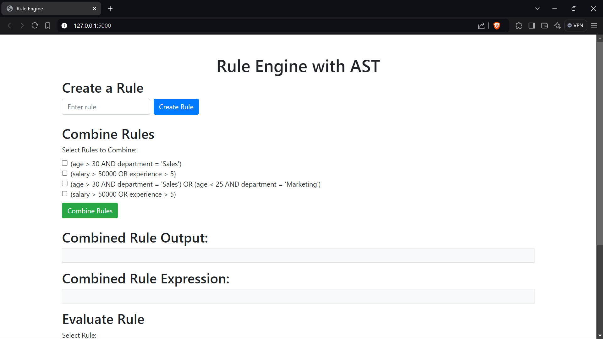

# Rule Engine with AST

The Rule Engine Application dynamically evaluates user eligibility based on attributes like age, department, income, and spending habits. It utilizes an Abstract Syntax Tree (AST) to efficiently create, combine, and modify conditional rules.

# Demonstration Video

[Watch Video](/Screenshots/20241017-0937-18.1310155.mp4)

## **Features**

- Rule Creation : User will be able to add the rules.
- Combine two or more rules.
- Evaluate the rules. 
- storage of each rule in database.

## **Technologies Used**
- Programming Language(Python)
- Flask
- Database - MongoDB
- HTML - UI
- Data Representation : Abstract Syntax Tree (AST)
## **Requirements**

- Python 3.8 or later
- Flask

## **Installation and Setup**

### 1. Clone the repository
- `git clone https://github.com/josephpeter231/Zeotap-AST`

### 2. Install Dependencies in terminal
- `pip install -r requirements.txt`

### 3. Start the Server
- `python app.py` (or) `flask run`
  (application can be accessed [http://127.0.0.1:5000/](http://127.0.0.1:5000/))

## Application Features
  - **Create rule:** Use `/create_rule` to create a new rule with logical conditions(POST method).
  - **List Rules:**  View all created rules in Homepage .
  - **Combine Rules:** Combine multiple rules using `/combine_rules` (POST method).
  - **Evaluate Rule:** Evaluate a rule against user data through `/evaluate_rule`, returning whether the criteria are met (POST method).

## **Evaluation of Rules**
1. Select a rule that is created previously.
2. Now give input in the form of json 
  - Testing for the rule `(salary > 50000 OR experience > 5)`
  `{
    "age": 30,
    "department": "Marketing",
    "salary": 60000,
    "experience": 6
  }
  `
  `Expected output : True`
3. Now updating user data to test False scenario.
`{
    "age": 30,
    "department": "Marketing",
    "salary": 0,
    "experience": 0
  }
  `
  `Expected output : False`

 
## Screenshots
### Screenshot 1

### Screenshot 2

